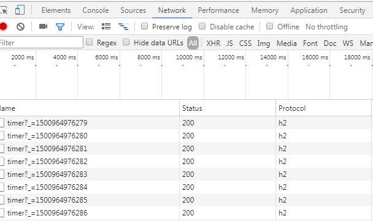

# Http2対応

* Spring boot 1.5.4
* Undertow

  
## Step 1 – update dependencies  

Add the following. switch tomcat to undertow.

```
	compile("org.springframework.boot:spring-boot-starter-web") {
		exclude module: "spring-boot-starter-tomcat"
	}
	compile("org.springframework.boot:spring-boot-starter-undertow")
```

## Step 2 – create a servlet container bean  

```java
@Configuration
public class ContainerConfig {
    @Bean
    UndertowEmbeddedServletContainerFactory embeddedServletContainerFactory() {
        UndertowEmbeddedServletContainerFactory factory = new UndertowEmbeddedServletContainerFactory();
        factory.addBuilderCustomizers(
                builder -> builder.setServerOption(UndertowOptions.ENABLE_HTTP2, true));
        return factory;
    }
}
```

## Step 3 - SSL enable

1. Generate keystore.

```
(rootdir)
keytool -genkey -alias undertow -storetype PKCS12 -keyalg RSA -keysize 2048 -keystore keystore.p12 -validity 3650
```

2. Add the following to application.yml.

```yml
server:
  ssl:
    key-store: keystore.p12
    key-store-password: XXXXX(設定したパスワード)
    keyStoreType: PKCS12
    keyAlias: undertow
```  

## Step 4 – run
1. run
2. https://localhost:8080/
3. Success if protocol [h2]



## Tips

### undertow accesslog

Add the following to application.yml

```yml
server:
  undertow:
    accesslog:
      enabled: true
      pattern: common
#      pattern: '%t %a "%r" %s (%D ms)'
      rotate: true
```